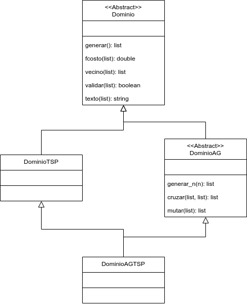

# IC-3002 Proyecto 2 #

Esqueleto para el proyecto de algoritmos probabilísticos para el curso IC-3002 Análisis de Algoritmos.

Este proyecto requiere python3.

Para instalar las dependencias correr:

```bash
pip3 install -r requirements.txt
```

Para correr todas las pruebas automatizadas:

```bash
pytest
```

Para correr solo algunas pruebas automatizadas, por ejemplo todas las pruebas cuyo nombre inicia con `test_validar`:

```bash
pytest -v -k "test_validar" dominio_tsp_test.py
```

## Diseño del dominio ##



Las soluciones se representan como listas de vértices, de acuerdo a la estrategia planteada en la lectura de algoritmos probabilísticos. 

Las clases abstractas `Dominio` y `DominioAG` no deben ser implementadas, simplemente especifican las interfaces de operaciones que deben ser implementadas.

La clase de `DominioTSP` extiende a `Dominio`, representa el dominio de soluciones al problema del vendedor viajero (TSP). Esta clase se utilizará en el algoritmo de *simulated annealing*. 

Por otro lado la clase `DominioAGTSP` extiende tanto a `DominioAG` como a `DominioTSP`. Esta clase se utilizará en el algoritmo genético.